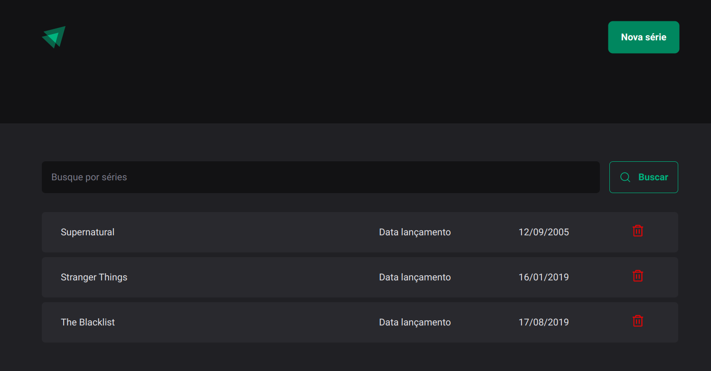

<h1 align="center"> Lista de Séries </h1>

<p align="center">
  
</p>

## 🚀 Tecnologias

Esse projeto foi desenvolvido com as seguintes tecnologias:

- ReactJs
- Styled Components
- Typescript
- Git e Github

## 💻 Projeto

Projeto cria uma lista de séries com o nome e a data de lançamento da mesma.

## Como instalar

```bash
npm install
```

## Como rodar o app

```bash
# development
$ npm run start

# watch mode
$ npm run start:dev
```

## Back-end

[api](https://github.com/luizSmith/exemplo-api)

Feito com ♥ by Eloisa de Oliveira com participação do Luiz Victor, vulgo Smith
